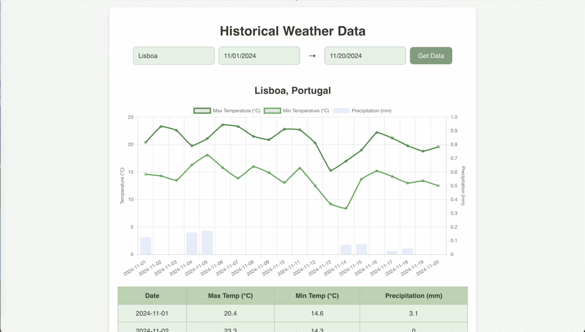

# Full-stack Weather App



This is a fullstack weather application that fetches historical weather data using the Open-Meteo API. The app allows users to input a location and date range, and it will return daily weather information, including maximum and minimum temperatures and precipitation. The data is displayed in both a chart and a table.

The backend will either return the data from the database (if already accessed) or fetch it from the Open-Meteo API, minimizing API requests.

A demo video can be accessed at https://drive.google.com/file/d/1ldS8joSQLrOX7EYFT8nTNQJt8YJti74x/view?usp=sharing

## Technologies Used

- **Backend:** Ruby on Rails
- **Frontend:** React
- **Database:** SQLite
- **Charting Library:** Chart.js
- **Weather API:** Open-Meteo API
- **Coordinates API:** Nominatim by OpenStreetMap

## Setup

### 1. Backend Setup

#### Install Ruby Dependencies

```bash
bundle install
```

#### Run the Rails Server

To start the backend server, run:

```bash
rails server
```

The server will be available at `http://localhost:3000`.

### 2. Frontend Setup

#### Install Dependencies

```bash
npm install
```

#### Run the React App

To start the frontend app, run:

```bash
npm start
```

The React app will be available at `http://localhost:3001`.

## Usage

Once both the backend and frontend are running, navigate to the frontend interface in your browser and follow these steps:

1. Enter the location (e.g., "Lisbon") in the input field.
2. Select the start and end dates using the date pickers.
3. Click the "Get Data" button to fetch the weather data.
4. View the historical weather information displayed as a chart and table.

## Backend
- Includes WeatherController that implements API endpoint that gets weather data with parameters (`location`, `start_date`, `end_date`). This controller fetches data from the database and in case of missing data calls WeatherService, then storing the fetched data in the database for caching and performance optimization, minimizing Open-Meteo API requests.
- Includes WeatherService that integrates the Open-Meteo API through HTTP requests.
- Defines WeatherRecord dtaa model for storing the historical weather information in the database. 
- Includes methods for handling coordinate conversion for a given location.
- Validates user inputs and handles errors.

## Frontend
- Allows users to input location and date range to retrieve data.
- Displays data using a chart and table.
- Includes validation for empty inputs and date ranges.

## API Details

```bash
GET /weather?location=<location>&start_date=<start_date>&end_date=<end_date>
```

- **Endpoint:** `GET /weather`
- **Parameters:**
  - `location`: The location for which you want to retrieve the weather data. A closest match will be obtained (to ensure that inputs such as 'Porto', 'oporto' or 'PORTO' are able to be accesed and are not stored as separate records)
  - `start_date`: The start date for the weather data range (format: `YYYY-MM-DD`).
  - `end_date`: The end date for the weather data range (format: `YYYY-MM-DD`).
- **Example Request:**
  ```bash
  curl "http://localhost:3000/weather?location=Lisbon&start_date=2024-11-10&end_date=2024-11-20"
  ```


## Challenges Faced
- **Setting Up**: Setting up and working with Ruby and React took a bit due to limited prior experience with these technologies, particularly in configuring development environments.
- **Location Accuracy**: Handling user input for ambiguous location names required matching with the closest location name, guranteeing that inputs such as 'Porto', 'oporto' or 'PORTO' are able to be accesed and are not stored as separate records.
- **Partial Data Fetching**: Guaranteeing that missing weather records were fetched from the API when there are still partial records stored in the database was a setback. A method to calculate missing records was then created to combat this issue.
- **API Request Minimization**: In order to minimize the number of HTTP requests to the Open-Meteo API I decided to, in case of missing records, fetch the records of the date range as opposed to ordering multiple HTTP requests to fetch each individual range that is missing, as a way to minimize the number of API requests.


## Future Work
- Integrate a test suite for unit, integration, and end-to-end testing.
- Integrate more weather data variables, across various charts, with options to select/deselect the variables we want to fetch and display.
- Enhance the UI with features like location autocomplete or multi-language support.
